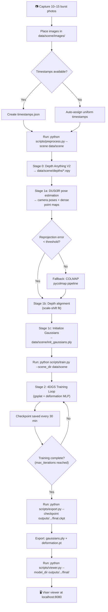
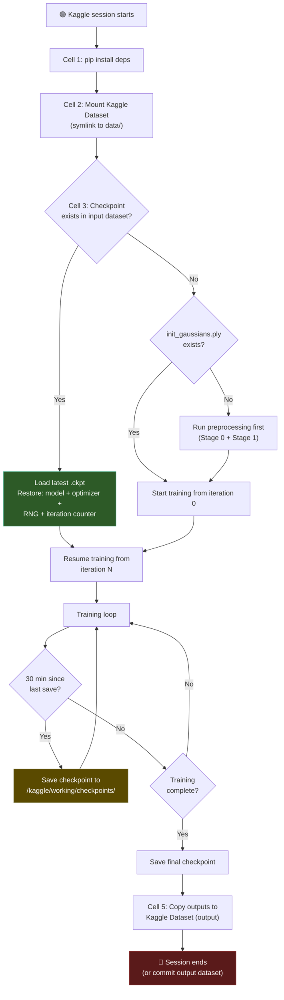
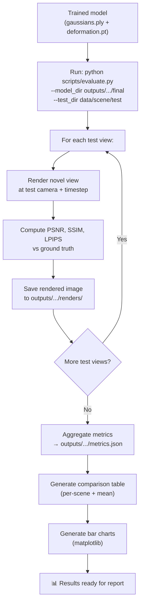
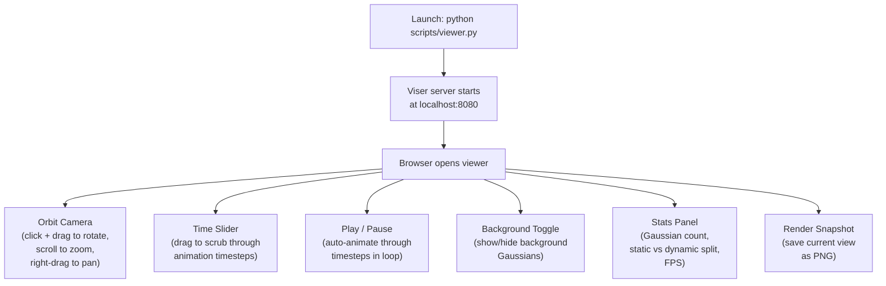

# SparseChron — Application Flow

Since SparseChron is a research pipeline (not a traditional web/mobile app),
"application flow" means the **developer/researcher workflows** through the
system.  There are four primary flows.

---

## Flow 1 — Full Pipeline (New Scene)

The end-to-end path from raw photos to interactive viewer.



---

## Flow 2 — Kaggle Training Session

The workflow inside a single Kaggle session, designed for interruption safety.



### Session Recovery

When a session times out unexpectedly:

1. Start a new Kaggle session
2. Attach the output dataset from the previous session as input
3. The resume logic auto-detects the latest valid checkpoint
4. Training continues from exactly where it left off (same iteration, same RNG state)

---

## Flow 3 — Evaluation & Benchmarking



### Evaluation Variants

| Variant | Command Flag | Purpose |
|---|---|---|
| Standard | `--eval_mode standard` | Full test set, all metrics |
| Quick | `--eval_mode quick` | 5 random test views, PSNR only |
| Baseline comparison | `--baseline_dir outputs/baseline/` | Side-by-side with vanilla 4DGS |
| Ablation | `--ablation no_depth` | Disable specific components |

---

## Flow 4 — Viewer Interaction

The Viser viewer is the demo-day deliverable. Here's what the user can do:



### Viewer Controls Summary

| Control | Input | Action |
|---|---|---|
| Rotate | Left-click + drag | Orbit camera around scene center |
| Zoom | Scroll wheel | Move camera closer/further |
| Pan | Right-click + drag | Translate camera laterally |
| Time scrub | Slider widget | Set current animation timestep |
| Play/Pause | Button | Auto-cycle through timesteps |
| Background | Toggle button | Show/hide static Gaussians |
| Snapshot | Button | Save current rendered view as PNG |
| Reset | Button | Return camera to default position |

---

## Flow 5 — Error & Recovery Paths

| Scenario | Detection | Recovery |
|---|---|---|
| Kaggle session timeout | Training loop doesn't finish | Resume from last 30-min checkpoint (Flow 2) |
| OOM during training | `RuntimeError: CUDA out of memory` | Reduce `max_gaussians`, enable more aggressive pruning, restart |
| DUSt3R pose failure | Reprojection error > 5px threshold | Automatic fallback to COLMAP (Flow 1) |
| Corrupted checkpoint | `torch.load()` raises exception | Skip corrupted file, load previous checkpoint; warn user |
| gsplat build failure on Kaggle | Import error | Use pre-built wheel pinned to Kaggle's CUDA version |
| NaN in loss | `torch.isnan(loss)` check | Log warning, skip iteration, reduce learning rate by 0.5× |
| Depth Anything V2 OOM | CUDA OOM on high-res images | Resize images to max 512px for depth estimation, then upsample |

---

## Data Flow Summary

```
raw_images/
    │
    ▼
┌──────────────────┐     ┌──────────────────┐
│  Depth Anything  │     │     DUSt3R       │
│  V2              │     │  (pose + points) │
└────────┬─────────┘     └────────┬─────────┘
         │                        │
    depths/*.npy          cameras.json
         │               pointmaps/*.npy
         │                        │
         └──────────┬─────────────┘
                    │
              depth_alignment
              init_gaussians
                    │
                    ▼
           init_gaussians.ply
                    │
                    ▼
         ┌──────────────────┐
         │   4DGS Training  │
         │   (gsplat loop)  │
         └────────┬─────────┘
                  │
         checkpoints/*.ckpt
                  │
                  ▼
         gaussians.ply + deformation.pt
                  │
          ┌───────┴────────┐
          ▼                ▼
    Viser Viewer      Evaluation
    (localhost)       (metrics.json)
```

---

*Derived from [PRD.md](file:///c:/Users/odeda/Desktop/Projects/IVP%20Project/PRD.md) and [TechSpec.md](file:///c:/Users/odeda/Desktop/Projects/IVP%20Project/TechSpec.md).*
