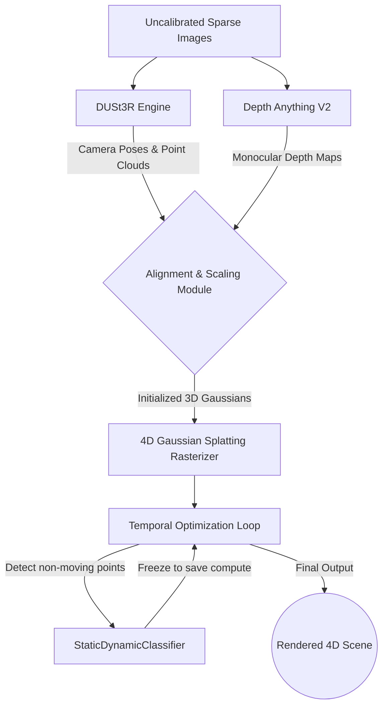

<h1 align="center">
  SparseChron 🌌
</h1>

<p align="center">
  <i>A highly optimized 4D Gaussian Splatting engine designed to synthesize dynamic scenes from sparse, uncalibrated datasets on heavily constrained hardware.</i>
</p>

<p align="center">
  
  
  
</p>

---

## 📖 Abstract

Traditional 4D Gaussian Splatting requires massive amounts of VRAM, dense multi-view video arrays, and pre-computed COLMAP camera poses. 

**SparseChron** breaks these constraints. It is a custom 4DGS pipeline that synthesizes highly accurate 4D structures from just **10-15 uncalibrated sparse images** (or custom dynamic datasets like HyperNeRF) while operating strictly within a **16GB VRAM limit** (e.g., free Kaggle T4 GPUs). By using **DUSt3R** (or a lightweight direct parser like `convert_hypernerf.py` to bypass pre-processing OOMs) and implementing dynamic compute-saving classifiers alongside temporal regularization, SparseChron brings state-of-the-art dynamic scene synthesis to accessible hardware.

---

## ✨ Key Contributions

- **🚫 Pre-processing OOM Bypass:** Replaces heavy SfM/DUSt3R runs with direct parser pipelines (e.g. `convert_hypernerf.py`) for large datasets, initializing Gaussians from points.npy and aligned OpenCV cameras.
- **📉 strict Memory Optimization:** Implements a hard cap of 350,000 Gaussians (configurable) to prevent Out-Of-Memory (OOM) crashes on 16GB VRAM limits.
- **✂️ Gradient-based Cloning & Splitting:** 3DGS-style adaptive density control — oversized Gaussians are split into smaller children, small ones are cloned, and transparent/oversized Gaussians are pruned, all under a strict VRAM budget.
- **🧊 Static-Dynamic Freezing:** Introduces a `StaticDynamicClassifier` that identifies Gaussians that have stopped moving over time and freezes them, significantly reducing rasterization compute load.
- **🎭 Temporal & Static Regularization:** Implements custom `temporal_smoothness_loss` (using randomized 4096-point dynamic subset sampling to keep training iterations blazing fast) and `static_regularization_loss` to prevent background deformation and floater artifacts.

---

## 🏗️ Pipeline Architecture



---

## 🚀 Quick Start & Installation

```bash
git clone https://github.com/rajhodedara/SparseChron.git
cd SparseChron

# We highly recommend using a conda environment
conda create -n sparsechron python=3.10
conda activate sparsechron

# Install PyTorch and dependencies
pip install -r requirements.txt
```

---

## ☁️ The Kaggle Training Workflow

SparseChron is engineered for disjoint 9-hour free Kaggle sessions. Note that `/kaggle/working` is wiped when an interactive session ends — checkpoints persist across sessions by **chaining notebook versions**:

1. **Upload Notebook**: Import `sparsechron_kaggle.ipynb` (repo root) into a new Kaggle session.
2. **Enable GPU + Internet**: Settings → Accelerator → GPU T4; Internet on (phone-verified account) for git/pip/wget.
3. **Run All**: The notebook autonomously installs dependencies (preferring a prebuilt gsplat wheel to skip the ~15 min JIT compile), downloads and converts the dataset, restores checkpoints attached from a previous version's output, and trains with VRAM logging every 100 iterations plus periodic validation renders + PSNR.
4. **Chain sessions**: After a session ends, **Save Version**, then in the next session attach this notebook's latest output via **+ Input → Your Work** and Run All — the restore cell copies the checkpoints in and `find_latest_checkpoint` resumes training automatically.

---

## 🛡️ License
This project is licensed under the MIT License.
