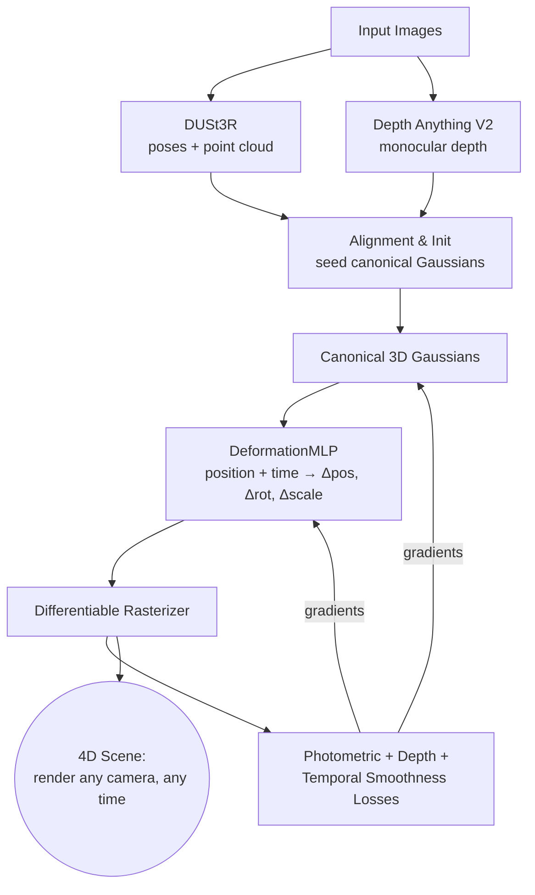

<h1 align="center">
  SparseChron 🌌
</h1>

<p align="center">
  <i>Reconstruct dynamic, animatable 4D scenes from ordinary photographs — then render them from any viewpoint, at any moment in time.</i>
</p>

<p align="center">
  
  
  
</p>

---

## 🌍 What is SparseChron?

SparseChron is a **4D Gaussian Splatting framework** — it turns images of a *moving* scene into a neural representation you can freely explore afterwards.

A 4D scene here means a **canonical set of 3D Gaussians** (the scene's "rest shape") plus a **learned, continuous-time deformation field** that animates every Gaussian over time. Once trained, the scene is a function of two inputs — *(camera, time)* — so you can:

- 🎥 Fly a virtual camera anywhere and watch the motion play back smoothly
- 🕹️ Scrub through time interactively in a browser viewer
- 📼 Export turntable orbit videos as MP4
- 🧊 Export the canonical shape as a standard 3DGS `.ply` and open it in any 3DGS viewer
- 📊 Measure reconstruction quality with PSNR / SSIM / LPIPS

**What you feed in:** just a handful of photos or frames of the dynamic scene. No dense video rigs, no LiDAR, no COLMAP — camera poses and geometry come out of the pipeline itself.

---

## 🎬 What can you reconstruct from?

| Input | How it works |
| --- | --- |
| **Your own photos** (~10–15 uncalibrated images) | **DUSt3R** recovers camera poses and a dense point cloud with no SfM preprocessing; **Depth Anything V2** provides per-frame monocular depth, aligned into the DUSt3R frame and used as extra supervision. |
| **D-NeRF scenes** (monocular synthetic video, e.g. `mutant`) | Direct downloader + converter (`scripts/prepare_dnerf.py`) handles the dataset and the OpenGL→OpenCV camera flip automatically. |
| **HyperNeRF captures** (multi-view video) | Lightweight direct parser (`scripts/convert_hypernerf.py`) reads `points.npy` + camera JSONs, bypassing heavy preprocessing entirely. |

---

## 🧠 How it works

### Scene representation

SparseChron models a dynamic scene as **static geometry + learned motion**:

1. **Canonical 3D Gaussians** — a set of anisotropic Gaussians, each with a learnable position, scale, rotation quaternion, opacity, and spherical-harmonics color. Initialized from the reconstructed point cloud.
2. **Deformation field** (`DeformationMLP`) — a small MLP that takes a Gaussian's position and a timestep (both Fourier-encoded) and predicts how that Gaussian moves: a position offset, a rotation offset, and a scale change. It is **zero-initialized**, so training starts from a perfectly static scene and gradually learns the motion — a stable, identity-preserving parameterization.
3. **Rasterization** — deformed Gaussians are rendered with the differentiable `gsplat` rasterizer (RGB + depth, mixed precision), and everything is optimized end-to-end by backpropagating image differences.


```mermaid
graph TD
    A[Input Images] --> B[DUSt3R<br/>poses + point cloud]
    A --> C[Depth Anything V2<br/>monocular depth]
    B --> D[Alignment & Init<br/>seed canonical Gaussians]
    C --> D
    D --> E[Canonical 3D Gaussians]
    E --> F[DeformationMLP<br/>position + time → Δpos, Δrot, Δscale]
    F --> G[Differentiable Rasterizer]
    G --> H[Photometric + Depth +<br/>Temporal Smoothness Losses]
    H -->|gradients| E
    H -->|gradients| F
    G --> I((4D Scene:<br/>render any camera, any time))
```

### Training loop

- **Photometric supervision** — L1 + SSIM against the captured frames.
- **Depth supervision** — optional, aligns rendered depth with monocular depth maps.
- **Temporal smoothness** — the deformation field is penalized for jumping between nearby timesteps (evaluated on a random 4096-point subset each iteration, so it stays cheap).
- **Adaptive density control** — 3DGS-style: Gaussians with high gradients are cloned or split, invisible/oversized ones are pruned, under a configurable budget.
- **Static/dynamic factorization** — a classifier accumulates how much each Gaussian has deformed; Gaussians that barely move are *frozen* and skip the deformation network entirely, cutting most of the per-iteration compute on mostly-static scenes (with a floor that always keeps some Gaussians dynamic).
- **Scheduling** — training warms up in 3D before enabling time, then decays learning rates; checkpoints are written automatically and training resumes from the latest one.

---

## 🚀 Getting Started

```bash
git clone https://github.com/rajhodedara/SparseChron.git
cd SparseChron

conda create -n sparsechron python=3.10
conda activate sparsechron

pip install -r requirements.txt
# note: gsplat compiles CUDA kernels on first install (10–15 min, silent)
```

### Train on a benchmark scene (D-NeRF `mutant`)

```bash
# download + convert the dataset (cameras, images, init points)
python scripts/prepare_dnerf.py --scene mutant --out data

# train the 4D model
python scripts/train.py --scene-dir data/dnerf_mutant --output-dir outputs_mutant \
    --is-4d --mixed-precision --checkpoint-iterations 2000
```

### Play with the result

```bash
# interactive 4D viewer: orbit the camera, scrub the time slider, auto-loop playback
python scripts/interactive_viewer.py --checkpoint outputs_mutant/checkpoint_30000.ckpt

# turntable orbit video (runs without a GPU)
python scripts/render_video.py --checkpoint-path outputs_mutant/checkpoint_30000.ckpt \
    --dataset-path data/dnerf_mutant --output-dir orbit_video

# export the canonical shape for standard 3DGS viewers
python scripts/export_ply.py --checkpoint-path outputs_mutant/checkpoint_30000.ckpt --output mutant.ply

# quality metrics (PSNR / SSIM / LPIPS)
python scripts/evaluate.py --checkpoint-path outputs_mutant/checkpoint_30000.ckpt \
    --dataset-path data/dnerf_mutant
```

### Reconstruct from your own photos

Follow **[notebooks/kaggle_custom_dataset.ipynb](notebooks/kaggle_custom_dataset.ipynb)** — drop in a folder of photos and it runs the full DUSt3R + Depth Anything V2 preprocessing, training, evaluation, and final MP4 export end-to-end.

---

## ☁️ Free Cloud Training (Kaggle)

Both notebooks run on a free Kaggle **T4 (16GB)** — SparseChron is tuned to fit comfortably within that budget. `/kaggle/working` is wiped when a session ends, so checkpoints persist across sessions by **chaining notebook versions** (Save Version → attach the output in the next session → training auto-resumes from the latest checkpoint).

| Notebook | What it does |
| --- | --- |
| [`sparsechron_kaggle.ipynb`](sparsechron_kaggle.ipynb) | One-click D-NeRF `mutant` run: dataset download → training → evaluation → renders + MP4 → interactive 4D viewer with a public tunnel |
| [`notebooks/kaggle_custom_dataset.ipynb`](notebooks/kaggle_custom_dataset.ipynb) | Same end-to-end flow for your own photo folder (DUSt3R poses + depth) |

---

## 📁 Repository Layout

```
SparseChron/
├── sparsechron/            # Core package
│   ├── data/               #   D-NeRF / HyperNeRF / COLMAP / DUSt3R dataset loaders
│   ├── models/             #   GaussianModel, DeformationMLP, renderer, static/dynamic classifier
│   ├── losses/             #   Photometric (L1+SSIM), depth, temporal smoothness, texture
│   ├── preprocessing/      #   DUSt3R poses, depth estimation & alignment, Gaussian init
│   ├── training/           #   Trainer, LR scheduling, checkpointing & auto-resume
│   ├── evaluation/         #   Benchmarks, PSNR/SSIM/LPIPS, novel-view rendering
│   └── viewer/             #   Viser 4D viewer (time slider, playback loop)
├── scripts/                # CLI entry points: train, evaluate, render_video, export_ply, ...
├── notebooks/              # Notebooks, incl. the custom-photos Kaggle workflow
├── sparsechron_kaggle.ipynb# D-NeRF Kaggle training notebook
├── configs/                # YAML experiment configs
└── tests/                  # Unit tests
```

---

## 🛡️ License
This project is licensed under the MIT License.
